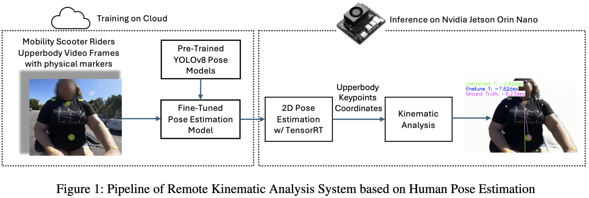

# Remote Kinematic Analysis for Mobility Scooter Riders Leveraging Edge AI

This repository contains the implementation and supporting resources for research paper **"Remote Kinematic Analysis for Mobility Scooter Riders Leveraging Edge AI"** presented at the **AAAI Fall Symposium 2024**. The project involves **marker detection** and dataset processing, alongside performance analysis using various metrics. Click Here! [https://doi.org/10.1609/aaaiss.v4i1.31808](https://doi.org/10.1609/aaaiss.v4i1.31808)



---

## Table of Contents
- [Remote Kinematic Analysis for Mobility Scooter Riders Leveraging Edge AI](#remote-kinematic-analysis-for-mobility-scooter-riders-leveraging-edge-ai)
  - [Table of Contents](#table-of-contents)
  - [Overview](#overview)
  - [Directory Structure](#directory-structure)
  - [Features](#features)
  - [Installation](#installation)
  - [Usage](#usage)
  - [License](#license)

---

## Overview

This repository implements marker detection and dataset processing workflows, optimized using tools like **TensorRT**. The project evaluates models using inference scripts and visualizes results through detailed plots.


## Directory Structure

- **Marker-Detection/**: Contains scripts and resources for detecting markers in datasets.
- **Process Dataset/**: Includes tools and scripts for preprocessing datasets for marker detection.
- **Result-metrics/**: Scripts for analyzing and visualizing performance metrics of the trained models.
- **ultralytics/**: A submodule or library dependency for training and inference with YOLO models.
- **main.py**: Entry point for executing the primary workflow.
- **plot_OKS.py**: Generates visualizations of model performance, such as OKS, PCK curves.
- **plot_Error.py**: Generates visualizations of error when inferencing using trained models.
- **README.md**: You're here!
- **.gitignore**: Lists files and directories ignored by Git.

---

## Features

- **Optimized Marker Detection**: Uses TensorRT for accelerated inference.
- **Dataset Processing**: Supports large-scale datasets.
- **Performance Metrics**: Includes scripts for precision, recall, F1 score analysis.
- **Visualization**: Tools for plotting key metrics in a visual format.

---

## Installation

1. Clone the repository:
   ```bash
   git clone https://github.com/Mobility-Scooter-Project/Remote-Kinematic-TensorRT.git
   cd Remote-Kinematic-TensorRT
   ```

2. Install dependencies:
   ```bash
   Install Python with neccessary libraries, TensorRT, ultralytics (GPU supported)
   ```

## Usage

1. Preprocess the dataset:
   ```bash
   <task_preprocess>.py
   ```

2. Run marker detection:
   ```bash
   python Marker-Detection/marker_label_with_frame.py 
   ```
3. Visualize results:
   ```bash
   python plot_<type>.py
   ```

---

## License

This project is licensed under [MIT License](LICENSE).
